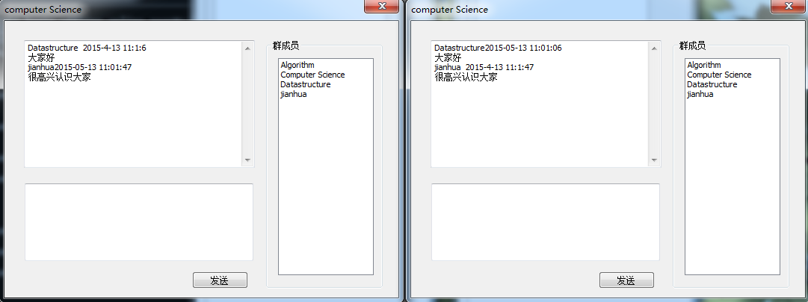
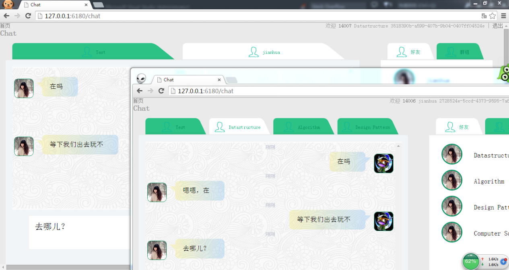
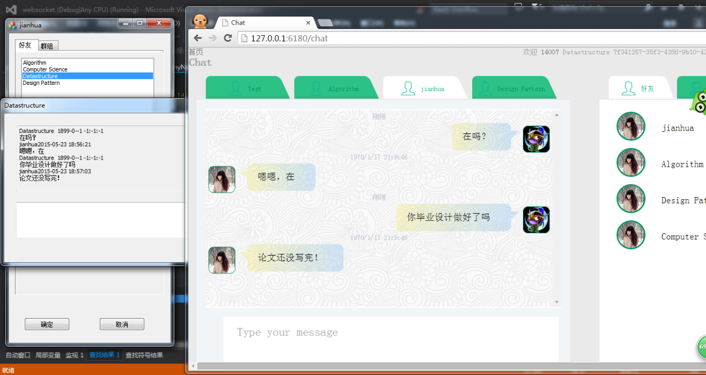
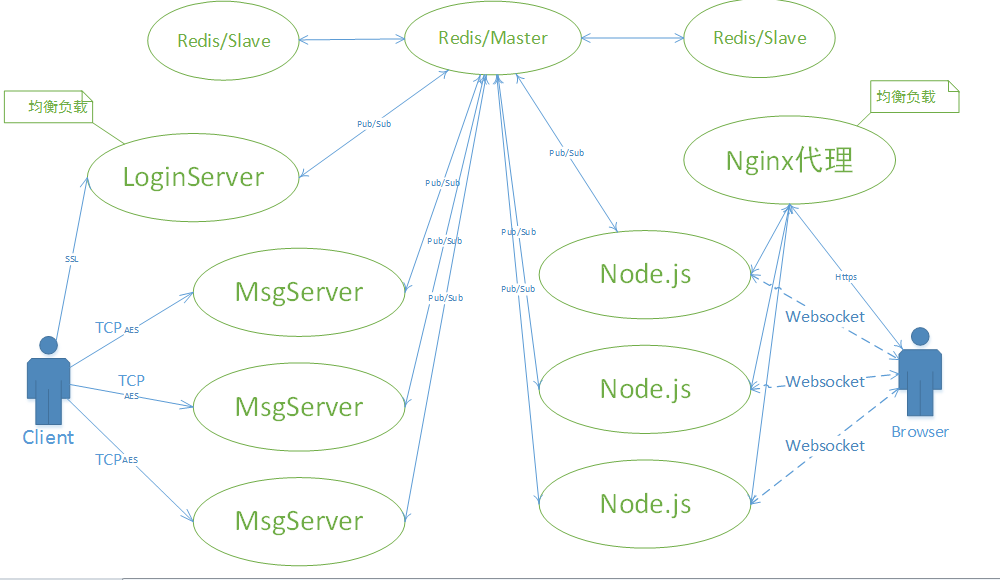

### 这是我的毕业设计

### 传统客户端采用C++开发，web端采用nodejs开发。不同服务器之间通过redis的发布订阅功能来互联。

### 系统总体设计
TCP服务器和客户端采用C++编写，通过TCP协议与服务器连接并由SSL安全传输层保证安全，实现即时通信。浏览器端通过HTML5中提出的Websocket协议与服务器连接，Websocket服务器和HTTP服务器采用Nodejs编写。不同物理服务器，不同语言服务器采用统一的数据传输格式来传输，借助redis数据库的Pub/Sub模式和消息队列，来进行服务器之间的信息通信。对数据库进行Master/Salve备份。

### 数据库设计

为了提高对数据的处理，采用缓存数据库Redis。Redis是一个Key-Value数据库，数据库设计主要体现在Key的设计。存储的数据是二进制安全的。

### 用户信息哈希表

|user:001|info|
|---|---|
|useId |用户ID |
|usename |用户名 |
|password |密码 |
|imageUrl |头像  |
|email    |邮箱|
|lastLoginTime|最近登陆时间|
|nickname |昵称|
### 群信息哈希表
|group:001|info|
|------|------|
|groupId|群号|
|groupName|群名称|
|imageUrl|群头像|

### 用户登录信息哈希表

|logined:14006|info|
|------|----|
|address |消息服务器地址|
|port |消息服务器端口|
|sessionid|密钥种子|

|Key类型|value info |exmaple|
|-----|-----|------|
|集合groupSet:(userid)|存储用户加入的群号|如groupSet:14006|
|集合friendsSet:(userid)|存储好友ID|如friendsSet:14006|
|列表unreadMsg:(userid)|存储用户二进制点对点未读消息|如unreadMsg:14006|
|键online:(userid)|存储用户在线的服务器Socket信息。|如online:14006|
|哈希表group:(group)|存储群信息|如group:1|
|列表groupMsg:(groupid)|存储二进制群消息|如groupMsg:1|
|列表groupMember:(groupid)|存储群成员ID|如:groupMember:1。|
|列表onlineGroup:(groupid)|存储当前在线群成员ID。|如：onlineGroup:1。|
|键unreadNumber:(userid):(groupid)|存储未读群消息数目。|如:unreadMember:14006:1。|
|哈希表loginMap:(userid)|存储用户登陆密钥和消息服务器信息。|如：loginMap:14006。|

有序集合serverRank存储消息服务器套接字信息及排名。
### 主要类和文件说明

- `Tcp_Server`:服务器网络连接类。采用Boost .Asio作为异步模型，实现高性能网络服务器。监听端口、接收新的连接，对每个连接创建新的Tcp_Session对象。
- `Tcp_Session`:网络连接Session类。接收、发送TCP流，PING数据包，错误处理，消息接收到后交付ProtubufCodec处理[22]。
- `Ssl_Server`:安全传输层TLS/SSL服务器网络连接类。
- `Ssl_Session`:安全传输层TLS/SSL连接Session类。
- `Connection_Manager`:网络连接管理类。管理连接用户ID与连接的映射关系，创建、退出时要处理的相关数据。
- `MyBuffer:`数据缓存区类。
- `ProtubufCodec`:网络消息封包和拆包及加密解密类。
- `ProtubufDispatcher`:处理函数和不同消息类型之间映射类。
- `Credis`：与redis数据库操作类，像管道，多操作原子性等复杂操作通过返回redisContext来处理。
